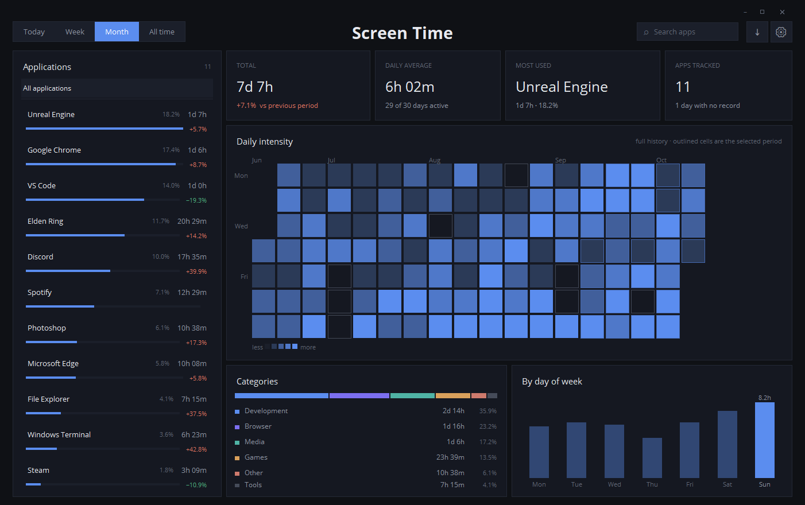

# Screen Time

[](https://github.com/00xSky/ScreenTime/releases/latest)


[](LICENSE)

A quiet screen time tracker for Windows. It runs in the system tray and records
only the app in the foreground. If there is no mouse or keyboard input for a
period you set, it stops counting.

No account, no server, no telemetry. The data never leaves the machine.

**[⬇ Download the latest release](https://github.com/00xSky/ScreenTime/releases/latest)**



## Download

The [latest release](https://github.com/00xSky/ScreenTime/releases/latest) has
two builds. Neither needs Python.

| File | When to pick it |
| --- | --- |
| `ScreenTime-<version>-win-x64.exe` | A single file: download and run. |
| `ScreenTime-<version>-win-x64.zip` | A folder: unzip and run `ScreenTime\ScreenTime.exe`. Starts faster, and antivirus tools flag it less often. |

The app goes straight to the system tray. Click the tray icon to open the window.

The builds are not code-signed, so Windows SmartScreen may warn the first time
you run them. Click **More info → Run anyway**.

To start it with Windows, put a shortcut to `ScreenTime.exe` in the Startup
folder (`Win+R` → `shell:startup`).

## Features

- **Persistent app panel** on the left: every tracked app, ranked, with its
  share and its change against the previous period.
- **Intensity heatmap** across the whole history, one square per day. A day
  with no record looks different from a day with zero usage — gaps stay
  visible instead of quietly inflating your averages. Hover for the value.
- **Four periods** — today, last 7 days, last 30 days, all time. The selected
  range is outlined inside the heatmap.
- **Categories** — browser, development, games, media, tools. Time read as
  what you were doing, not just which binary was in front.
- **Day-of-week profile** — which day is actually your heaviest.
- **What stands out** — plain sentences generated from the data: how the
  period compares to the one before, which app moved the most, whether one
  app is eating everything, what is new this period.
- **Per-app detail** — click any app for its own heatmap, daily trend, active
  days and busiest day.
- **Idle detection** — stops counting after a configurable period without input,
  so a window left open overnight does not become "usage".
- **Readable app names** — `unrealeditor` becomes Unreal Engine.
- **Dark and light themes**, English and Turkish.
- **CSV export** of the selected period, for spreadsheets or your own charts.

## Run from source

Windows and Python 3.9 or newer.

```
git clone https://github.com/00xSky/ScreenTime.git
cd ScreenTime
pip install -r requirements.txt
```

Silently, the way the Startup shortcut does it:

```
wscript run_hidden.vbs
```

With a console attached, useful while debugging:

```
python main.py
```

The window does not open by itself. Click the tray icon to show or hide it;
right click for **Exit**. Closing the window only hides it — tracking continues.

### Start with Windows

Put a shortcut to `run_hidden.vbs` in the Startup folder
(`Win+R` → `shell:startup`).

### Build the exe

```
pip install pyinstaller
pyinstaller ScreenTime.spec              # single file: dist\ScreenTime.exe
pyinstaller ScreenTime.spec -- --onedir  # folder: dist\ScreenTime\
```

## Data

Where the files live depends on how the app runs:

| Run as | Day files | Settings |
| --- | --- | --- |
| Release exe | `%APPDATA%\ScreenTime\data\` | `%APPDATA%\ScreenTime\settings.json` |
| From source | `data\` in the working folder | `settings.json` next to the code |

One file per day, named `DDMMYY.json`:

```json
{
  "Edge": 22162,
  "Unrealeditor": 18472,
  "File Explorer": 5241
}
```

Values are seconds of foreground time. Past days are immutable, so the app reads
each one at most once per session and keeps the totals in memory.

Counters are flushed to disk every 60 seconds and on exit, so an unexpected
shutdown loses at most a minute.

## Settings

Stored in `settings.json` (see the table above), edited from the gear icon:

| Key | Default | Meaning |
| --- | --- | --- |
| `theme` | `dark` | `dark` or `light` |
| `language` | `en` | `en` or `tr` |
| `idle_enabled` | `true` | stop counting while there is no input |
| `idle_timeout` | `60` | seconds of no input before idle |
| `hide_system` | `true` | keep shell and search processes out of the list |

System processes are always recorded; `hide_system` only filters the view, so
turning it off shows the full picture without losing anything.

## Your own app names

The built-in list only names common apps; anything else shows a tidied-up
process name under "other". To name and group your own apps, create
`appnames_local.json`:

| Run as | Location |
| --- | --- |
| Release exe | `%APPDATA%\ScreenTime\appnames_local.json` |
| From source | next to the code |

```json
{
  "names": {
    "krita": "Krita",
    "obsidian": "Obsidian"
  },
  "categories": {
    "tool": ["krita", "obsidian"]
  }
}
```

Keys are process names in lower case, without `.exe`. Both sections are
optional; categories are `browser`, `dev`, `game`, `media` and `tool`, and
unknown ones are ignored. Your entries override the built-in ones. The file is
read at startup and is git-ignored, so it is never committed.

## Layout

| File | Role |
| --- | --- |
| `main.py` | tray icon, main loop, wiring |
| `tracker.py` | sampling thread, daily files, aggregation |
| `ui.py` | the window |
| `heatmap.py` | intensity heatmap, day-of-week profile |
| `charts.py` | bar chart, composition bar, scrollbar, tooltip |
| `insights.py` | turns the numbers into sentences |
| `theme.py` | palette, type scale, spacing |
| `i18n.py` | interface strings |
| `appnames.py` | process name to display name, categories |
| `settings.py` | preference file |
| `paths.py` | where data and settings live (exe vs. source) |
| `utils.py` | formatting, CSV export |
| `ScreenTime.spec` | PyInstaller build |
| `tools/make_icon.py` | rebuilds `assets/ScreenTime.ico` |

## Known limits

- Measurement is at window level, so a browser is one row. There is no per-site
  or per-tab breakdown.
- Only the foreground window is counted. A minimized window counts as nothing.
- No intraday detail: a day is a single total per app, with no timestamps.
- Days before idle detection was added were recorded without it, so old and
  new days are not strictly comparable.

## License

Free to use, modify and share, but not to sell.

Screen Time is released under the MIT License with the
[Commons Clause](https://commonsclause.com/) condition. You may use, copy,
modify and redistribute it, at home or at work. You may not sell it, or sell a
product or service whose value comes mainly from it. See [LICENSE](LICENSE) for
the full text.

Because of the Commons Clause, Screen Time is source-available rather than open
source in the OSI sense.
